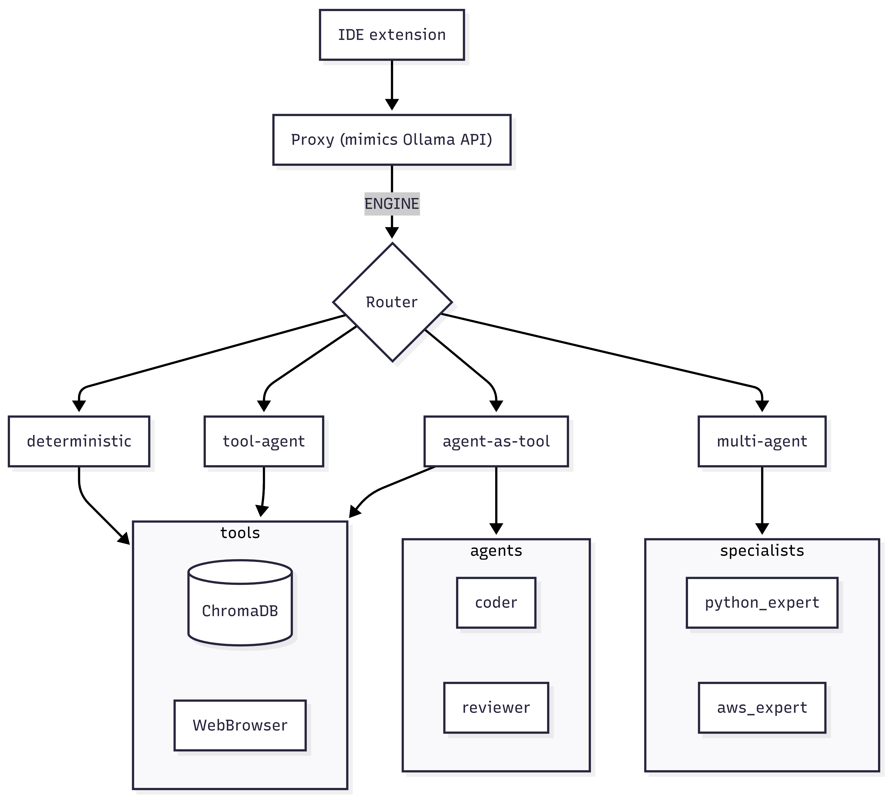
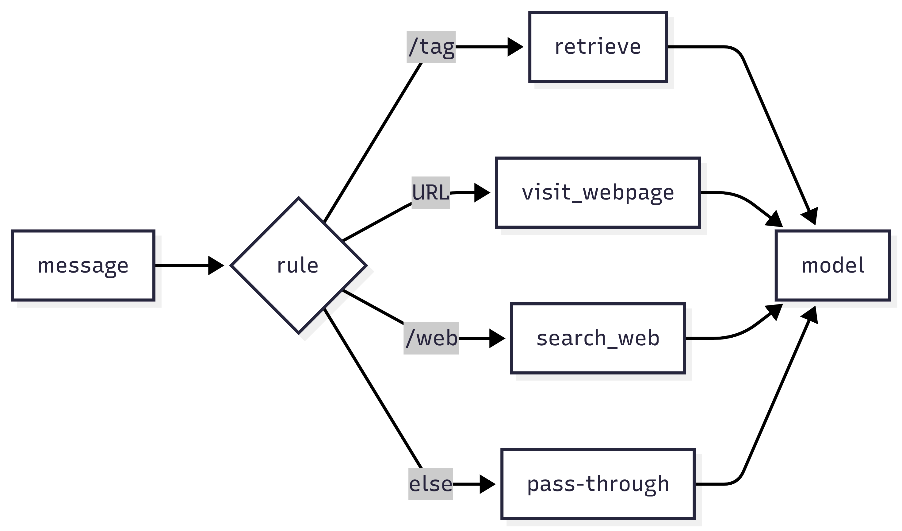
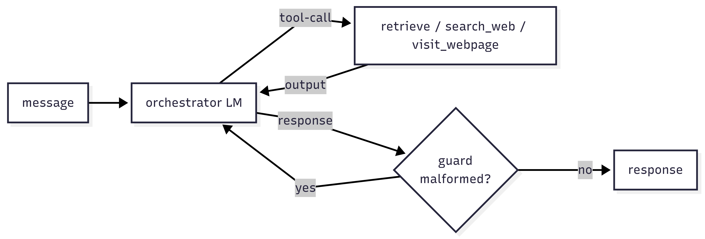
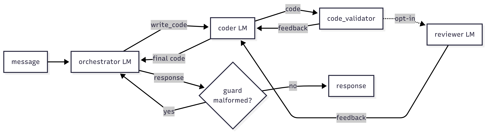
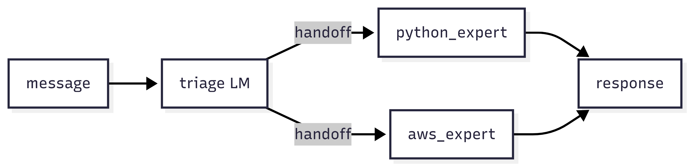

## Ollama wasn't enough anymore

In recent years, IDE extensions that talk directly to Language Models (LM), small or large (SLM, LLM), or to agentic platforms, have sprung up like mushrooms. And from the start, the first question was: what's open source out there ? I tried [Ollama](https://ollama.com/) locally: it works, it's private, it costs nothing.

But the SYSTEM prompt alone wasn't enough anymore: I wanted to use `/tag`s, and lean on a local RAG (Retrieval-Augmented Generation) over the documentation I actually need. And, while I was at it, to set up a base for experimenting with agentic systems.

The second question that led me to write this article was: who decides what to do with a given message ? Answering from the model's own knowledge, querying the RAG, searching the web, or generating code are four roads, and choosing between them is a degree of freedom you pay for. The more I let the LM decide, the more flexible the system becomes, but the less predictable and testable, and the harder its cost to pin down.

First of all there's level zero: a custom model that decides nothing but answers with the SYSTEM prompt it's given. From there you climb, four rungs in all:

| Engine | Who decides the routing | Testable without LM | Flexibility | Cost/complexity |
|---|---|---|---|---|
| 0. SYSTEM (custom model) | nobody: it just generates | no | minimal | none |
| A. deterministic router | fixed rules (`/tag`, URL, `/web`) | yes, pure function | low | low |
| B. agent + tool | the LM | no (mock the LM) | high | medium |
| C. orchestrator + agent-as-tool | the LM, with a specialist underneath | no | high | medium-high |
| D. multi-agent with handoff | the agents, as peers | no | very high | high |

As a lazy developer, I add just enough: I moved to A, the skeptic's version, the one that runs on fixed rules (the `/tag`s) and tests as pure code, and I added complexity only when I proved it wasn't enough anymore.

A detail that helps read the scale: a single agent-as-tool is enough to already be multi-agent. The discriminator isn't how many agents there are, but who holds control of the conversation:
- one agent talks to the user and calls the others as tools (agent-as-tool): it uses them as consultants, gets a result back, and control always stays with it
- more agents pass control around (handoff): whoever receives the conversation takes it over, talks to the user, and can hand it to another; the agents are cooperating

## An engine for every degree of freedom

The four engines coexist in the same code and can be compared side by side by changing one variable: the full structure is in the [README](https://github.com/bilardi/custom-ai-agents), here I recount the experiments.

A, the deterministic one, gives the LM only the material the user decides: with a `/tag` it queries the matching topic of a RAG, if there's a URL its content is fetched, `/web` searches the web, and everything else goes straight to the model. No decision is the LM's, which only produces the final text from the given context. With dependency injection everywhere (the dependencies, like the RAG client or the HTTP sessions, injected from outside, so in tests I replace them with mocks), this engine is fully covered by fast, offline tests: there's a method that queries the RAG, a method that fetches a URL's content, and a method that fetches web search results; the LM comes in only at generation, and in tests it's mocked. Precisely the default behavior, the pass-through (the question forwarded to the model as-is, with no added context), reveals the limit: deciding "can I answer on my own or should I search the web ?" isn't expressible as a rule, it's a decision for the LM. That's the reason to climb to B.

B, the tool-agent, puts the LM in place of the rules: an orchestrator decides which methods to use, whether the RAG, the URL or the web. These methods become its tools, and it picks them by emitting a tool-call (the structured call with which the model invokes a method) based on their description: the methods' docstring is the contract the agent reads to pick them. But the risk isn't only calling the wrong tool, it's whether or not to use its output: calling a tool doesn't mean grounding the answer on what it returns. That's grounding (the answer built on the retrieved content instead of made up), and the agentic mechanism doesn't guarantee it; to get it you have to try several embedders (the models that turn text into vectors for similarity search) and tune parameters like the chunk size (the pieces I split the documents into), until you hit the right combination (detail in the [grounding](https://github.com/bilardi/custom-ai-agents/blob/master/benchmark/grounding.md) benchmark). An agent with tools is enough when there's a single domain: to specialize a part of it you climb to C.

C, the agent-as-tool, adds a specialization without rewriting the architecture: a coder that the orchestrator consults as if it were a tool and from which it gets code back, while control stays with it. The coder is an LM that doesn't start from scratch: it gets the context already retrieved by the orchestrator and, if it needs more, can call the tools itself (for example `retrieve`, to enrich itself with more documentation from the RAG). Consulting a sub-agent, though, nests the calls: the orchestrator calls the coder, which in turn works and queries its tools, hence more latency. A full multi-agent here would be over-engineering: the coder is a consult, not a transfer of control.

D, the multi-agent, is the last rung: no longer a consult but a handoff, control passing from one agent to another. A triage picks the right specialist and passes the baton; under the hood it's a tool-call like B's, to another LM. If the model doesn't emit it reliably the pass doesn't happen and the conversation stays with the triage. Handoff is worth it only when giving up control is truly necessary; for a simple consult, C is enough.

Every rung is a trade-off, in one line:
- A doesn't decide but is free and testable
- B decides but is no longer predictable
- C specializes but nests more calls
- D transfers control but wants reliable tool-calls

As a good developer, I verified every trade-off with a reproducible benchmark: one each for A, B, C and D.

## Head-scratchers and performance

### What the mock didn't see

When I started the first experiments, there were no IDE extensions that let you use custom URLs, so it all started by simulating Ollama's API with [FastAPI](https://fastapi.tiangolo.com/): another technology I recommend, a REST API with built-in validation that you stand up in a few lines.

The unit tests covered the tools and part of the Ollama simulation, but the bulk had to be tested by using it and seeing what was still missing: Ollama has its documentation, but I had no intention of implementing all the APIs, only the strictly necessary ones.

And then there was the response format that wasn't what the Ollama client expected: a single JSON when there's no streaming, NDJSON (one JSON object per line) when there is. Small things, each capable of making everything else look broken.

The important point was testing everything that was invisible in the code but handled by the [any_agent](https://github.com/mozilla-ai/any-agent) library, which supports several agentic frameworks.

With async and await I've always had heated clashes, and as a lazy developer I'd taken the easy road: a synchronous framework, [smolagents](https://github.com/huggingface/smolagents).

Except that on the second call to the LM, I hit a `RuntimeError: Event loop is closed`. The cause wasn't in my code, it was precisely using a synchronous framework in an async context, with a bridge that creates and closes an event loop on every call while the Ollama client, instead, persists. The fix was moving to the [tinyagent](https://github.com/mozilla-ai/any-agent) framework, with any_agent's native async runtime: a single loop for the whole request, and the client stays valid across the steps.

### Small models and the tool-call

We're always talking about small models, manageable with Ollama and usable on a laptop GPU: llama3.2:3b and qwen2.5 performed best, but they had their ups and downs.

Using the agent-as-tool engine, delegation turned out to be the fragile part. Delegation is the orchestrator's decision to call the coder instead of answering itself: with the retrieve's chunks already in hand it answered on its own, even hallucinating a non-existent API. With a generic prompt it didn't delegate: it took a dedicated prompt to force it to delegate the coding tasks (detail in the [orchestrator](https://github.com/bilardi/custom-ai-agents/blob/master/benchmark/orchestrator.md#orchestrator-prompt-agent_as_tool)).

Delegation and the tool-call are related but distinct. Delegation is a choice of the model, steerable with the prompt. The tool-call is the mechanism the model uses to invoke a tool, the coder included: it's on this mechanism that the tweaks below act, where the tool-call takes center stage.

- **tinyagent doesn't handle the tool-call over `/api/chat`**: over Ollama's native provider the tool-call comes back as text and isn't recognized; over the OpenAI-compatible `/v1` endpoint it arrives in the structured function-calling format (the standard by which the model declares which tool to call and with which arguments) and tinyagent reads it. This way, llama3.2:3b goes from non-parsable to delegating in 80% of cases (detail in the [orchestrator](https://github.com/bilardi/custom-ai-agents/blob/master/benchmark/orchestrator.md#results-via-v1))
- **qwen2.5 adds extra arguments**: it sometimes injects into the call a `toolbench_rapidapi_key` too (an authentication parameter the tools I'd implemented didn't have), and the call fails; the patch was to absorb the extra arguments with a `**kwargs` in every tool's signature
- **with llama3.2:3b, the tool-call ends up in the text**: sometimes it writes the tool-call as text in the final answer (`{"name": ...}`, `<|python_tag|>`) and the user gets a useless or unreadable reply; with a deterministic guard in the engine, these cases are recognized and the orchestrator is re-run: malformed outputs drop from ~20% to ~10%, and delegation rises to 90% (detail in the [orchestrator](https://github.com/bilardi/custom-ai-agents/blob/master/benchmark/orchestrator.md#anti-malformed-guard-the-turning-point))
- **the multi-agent handoff is a tool-call**: the triage passes control to a specialist precisely by emitting it, but via the [OpenAI Agents SDK](https://github.com/openai/openai-agents-python), the only framework any_agent wires for handoff: tinyagent and the others don't; and so llama3.2:3b manages to pass in 60% of cases against the 90% of a more capable model like qwen2.5 (detail in the [multi_agent](https://github.com/bilardi/custom-ai-agents/blob/master/benchmark/multi_agent.md#results-n5))

Before returning the code, the coder passes it through a deterministic check on the syntax (with `ruff` as a signal): not the guard from before, which watches the orchestrator's answer, but a code_validator on the generated code. It doesn't catch everything, though: an invented API is syntactically valid and passes the gate. To catch these cases I added the reviewer, a second LM agent that re-reads the coder's code and judges its semantics: does it answer the task ? does it use APIs that really exist ? It's the only tweak that has nothing to do with the tool-call, and the only one that didn't pay off on the small model: on llama3.2:3b it flags everything, 100% false positives, marking even correct code as wrong, so as a filter it's useless. On qwen2.5, more capable, it starts to discriminate: it catches 90% of the invented APIs, but still wrongly flags 45% of the correct code (detail in the [reviewer](https://github.com/bilardi/custom-ai-agents/blob/master/benchmark/reviewer.md#results)). That's why I made it opt-in, useful only with a bigger model.

### Two planes

I'd started from the skeptic's version: a deterministic system, predictable and testable. The deterministic system is the genuinely useful part locally: fast model, no fragile tool-calling, good retrieval, it's the one you can actually use. Agentic systems, on modest hardware, seemed just an experiment; but with three targeted moves (the `/v1` endpoint, the delegation prompt, the guard) it manages to produce something sensible 90% of the time, even with limited resources: malformed outputs can happen, and this reminds us we're working with a non-deterministic system.

## What else is there to explore ?

Some of the deep-dives that follow aren't just improvements, but real stories to dig into, always in the interest of exploring the technologies you can put to use locally.

The choice of the augmented-generation backend could change depending on need. Here I used [ChromaDB](https://www.trychroma.com/), but the `Retriever` interface is already designed to accept a different vector backend or a graph; there could be valid alternatives anyway, like the locally-managed [MCP](https://modelcontextprotocol.io/) (Model Context Protocol) servers that are emerging. And, independently from this, there's still deterministic document processing to explore. When and which is worth it, and where to put the shared indexing parts, is a topic in itself.

Still on document handling, another road is improving the prompt or the tools available to the coder and the reviewer:
- having a system that gives the coder all the signatures with descriptions would greatly improve its answer
- having a deterministic system that spots, from the coder's answer, the signatures used, and one that provides the most similar signatures straight from the documentation, would give the reviewer a better yardstick

And to close, the choice of the multi-agent framework for the coordination pattern: here the handoff goes through the only framework any_agent wires for this (OpenAI Agents SDK). A real comparison among the alternatives (graph, supervisor, roles, conversation) depends on the kind of multi-agent you need, not on a minimal case like this, with just two specialists (Python and AWS).

The underlying idea is to range widely to get to know all these technologies, touch their limits, and understand what holds up locally and what doesn't. Some things stand up on a laptop GPU; others need a more capable model, unless new technologies can make a less performant one viable, for example by improving its context. Knowing where each technology stops is already half the work for tomorrow's project.
